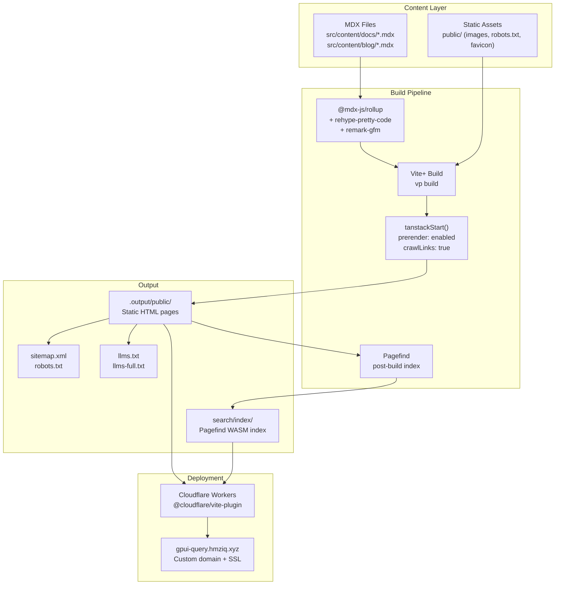

# feat: gpui-query documentation and marketing website

## Summary

Build a full-fledged documentation and marketing website for gpui-query — a TanStack Query-inspired async state management library for the Zed GPUI framework in Rust. The site uses TanStack Start with static prerendering (SSG), deployed to Cloudflare Workers at `gpui-query.hmziq.xyz`, with shadcn/ui components, MDX-based content (blog, docs, FAQ, API reference), maximum SEO optimization (structured data, sitemap, meta tags), and AI-crawler optimization (llms.txt, .md alternatives).

## Problem Frame

gpui-query is a mature library with a three-layer architecture (core/client/hook), 30+ public types, and 15+ hooks — but it has no web presence. Developers discovering the library through GitHub alone miss the curated guides, interactive examples, and discoverable content that drive adoption of comparable libraries like TanStack Query. The website closes this gap by providing a polished, SEO-optimized documentation hub that ranks for Rust/GPUI/async-state search terms and serves both human developers and AI agents.

---

## Requirements

**Site foundation and deployment**

- R1. The site is built with TanStack Start using static prerendering (SSG), producing static HTML files at build time with zero server-side runtime
- R2. The site is deployed to Cloudflare Workers at custom domain `gpui-query.hmziq.xyz` via GitHub Actions CI/CD
- R3. The site uses shadcn/ui as its component library, initialized with the user-specified preset (`b3J9hjfr8M`)
- R4. All development uses the Vite+ (`vp`) CLI as documented in `web/AGENTS.md`

**Content and documentation**

- R5. The site provides comprehensive documentation covering all three layers of gpui-query: core types, client (QueryClient), and hooks (use_query, use_mutation, use_infinite_query, use_query_select)
- R6. Documentation content is authored in MDX with Rust syntax highlighting and frontmatter metadata
- R7. A marketing landing page presents the library's value proposition, features, and quick-start example
- R8. A blog system supports timestamped posts with tags, RSS feed, and listing/pagination
- R9. A FAQ page covers common questions with accordion UI and FAQPage structured data

**SEO and AI optimization**

- R10. Every route has unique meta tags (title, description, canonical URL, Open Graph, Twitter Card)
- R11. JSON-LD structured data is emitted per page type: SoftwareSourceCode (home), TechArticle (guides), HowTo (tutorials), FAQPage (FAQ), BlogPosting (blog posts)
- R12. A `sitemap.xml` is auto-generated from all prerendered routes
- R13. A `robots.txt` references the sitemap and allows all crawlers
- R14. An `llms.txt` and `llms-full.txt` serve structured markdown content for AI agents, following the llmstxt.org specification
- R15. Raw `.md` alternatives are served for every documentation page so AI crawlers can fetch clean markdown

**Design and UX**

- R16. The UI uses a documentation-site layout pattern (persistent sidebar nav for docs, top-level nav for main sections)
- R17. Code blocks feature Rust syntax highlighting with copy-to-clipboard functionality
- R18. The site is fully responsive with mobile navigation
- R19. Dark and light mode is supported via system preference and toggle

---

## Key Technical Decisions

**KTD-1. Static prerendering via TanStack Start `prerender` config, not a separate static adapter.**
TanStack Start v1.168+ supports `prerender` in the plugin config with `crawlLinks` and `autoStaticPathsDiscovery`. This is the official approach — no separate static export tool needed. The Cloudflare Workers plugin remains for serving prerendered assets; all routes render to HTML at build time.

**KTD-2. Cloudflare Workers deployment with `assetsOnly: true` for zero-cost static serving.**
The scaffold already has `@cloudflare/vite-plugin` configured. Setting `assetsOnly: true` on the plugin config produces a purely static deployment with no Worker invocation at all — assets are served directly from Cloudflare's edge CDN. This eliminates Worker execution costs entirely for a fully prerendered site. Custom domain is configured in the Workers dashboard. (Note: `_headers` and `_redirects` files are Cloudflare Pages conventions and may not be fully supported in Workers mode — use Cloudflare dashboard Rules for caching headers instead.)

**KTD-3. MDX via `@mdx-js/rollup` for content authoring.**
MDX compiles at build time, supports React components inline (callouts, code blocks, interactive examples), and integrates with Vite's plugin pipeline. Plain markdown would lose component composability; a CMS would add deployment complexity.

**KTD-4. `import.meta.glob` for content discovery (not server functions or file-system reads).**
For a static site, all content must be resolved at build time. Vite's `import.meta.glob` with `{ eager: true }` resolves MDX modules into the bundle during the build — no runtime file-system access, no server functions needed. This avoids the SSR/SSG boundary pitfall where `createServerFn` creates callable RPC endpoints. Frontmatter is exported as named exports via `remark-mdx-frontmatter` (required alongside `remark-frontmatter` — the latter parses but does not export).

**KTD-4b. Navigation derived from frontmatter, not a separate manifest.**
The docs sidebar, pagination, and prerender page list are all derived from `getAllDocs()` which reads frontmatter from MDX files via `import.meta.glob`. There is no separate `docs-nav.ts` manifest — the frontmatter `category`, `order`, and `title` fields are the single source of truth. This eliminates the synchronization burden of maintaining a parallel manifest.

**KTD-4c. Dynamic route prerendering via explicit `pages` config, not `crawlLinks` alone.**
TanStack Start's `autoStaticPathsDiscovery` explicitly skips dynamic routes (routes containing `$` in the path). The `crawlLinks` approach is fragile — it depends on the docs index page rendering complete link lists. Instead, the plan uses the `pages` config array in `tanstackStart()` to explicitly enumerate all doc and blog slugs. This array is generated programmatically from the content directory at build config time via a Vite plugin or a config-resolution step that reads MDX filenames.

**KTD-5. Pagefind for search (not Algolia or FlexSearch).**
Pagefind is a static search index generator that runs post-build, creates a lightweight WASM-based index, and requires zero server infrastructure. Ideal for SSG sites. Algolia requires an external service; FlexSearch requires shipping the full corpus to the client.

**KTD-5b. llms.txt and .md alternatives generated via build-time scripts, not TanStack Router routes.**
Serving plain text files (`llms.txt`, `llms-full.txt`, `.md` alternatives) through TanStack Router's HTML layout is architecturally mismatched — the root layout wraps all routes in `<html>/<head>/<body>`. Instead, these files are generated by build-time scripts that read MDX source files, strip frontmatter, and write plain text/markdown to the output directory. This avoids the layout-bypass problem entirely.
**KTD-6. rehype-pretty-code with shiki for syntax highlighting.**
rehype-pretty-code provides line-level highlighting, line numbers, and title/caption support inside MDX code blocks. shiki is the underlying highlighter with excellent Rust support and VS Code–quality themes. This runs at build time inside the MDX pipeline — no client-side highlighting needed.

**KTD-7. Vite+ (`vp`) CLI for all build/dev commands.**
The project uses Vite+ as documented in `web/AGENTS.md`. All scripts use `vp dev`, `vp build`, `vp check`, `vp test` rather than raw `vite` or `pnpm` commands. The pre-commit hook runs `vp check --fix` with type-aware linting.

---

## High-Level Technical Design



**Data flow:** MDX content files are compiled by the Vite plugin chain (MDX → rehype-pretty-code → TanStack Start prerendering). TanStack Router's file-based routing maps route files to URLs; route loaders use `import.meta.glob` to resolve MDX modules at build time. The prerender phase crawls all linked pages, generating static HTML. Pagefind indexes the output post-build. The Cloudflare Workers deployment serves everything from edge locations.

**Content routing pattern:** Each documentation route file (e.g., `src/routes/docs/$slug.tsx`) uses `import.meta.glob` to map slugs to MDX modules. The route's `head` function extracts frontmatter metadata for SEO. The `loader` resolves the MDX component for rendering. Blog posts follow the same pattern under `src/routes/blog/`.

---

## Output Structure

```
web/
├── src/
│   ├── components/
│   │   ├── ui/                    # shadcn/ui components
│   │   ├── docs-sidebar.tsx       # Documentation sidebar navigation
│   │   ├── docs-pagination.tsx    # Previous/Next page navigation
│   │   ├── navbar.tsx             # Top-level navigation bar
│   │   ├── footer.tsx             # Site footer
│   │   ├── mobile-nav.tsx         # Mobile hamburger navigation
│   │   ├── code-block.tsx         # Syntax-highlighted code with copy button
│   │   ├── callout.tsx            # Info/Warning/Tip callout boxes
│   │   ├── mdx-components.tsx     # Custom MDX component overrides
│   │   ├── theme-toggle.tsx       # Dark/light mode switch
│   │   ├── seo-head.tsx           # Per-route SEO meta helper
│   │   └── search-dialog.tsx      # Pagefind search command palette
│   ├── content/
│   │   ├── docs/                  # Documentation MDX files
│   │   │   ├── getting-started.mdx
│   │   │   ├── core-concepts.mdx
│   │   │   ├── queries.mdx
│   │   │   ├── advanced-queries.mdx
│   │   │   ├── mutations.mdx
│   │   │   ├── advanced-mutations.mdx
│   │   │   ├── infinite-queries.mdx
│   │   │   ├── caching.mdx
│   │   │   ├── retry.mdx
│   │   │   ├── query-client.mdx
│   │   │   ├── query-keys.mdx
│   │   │   ├── observers.mdx
│   │   │   ├── devtools.mdx
│   │   │   ├── persistence.mdx
│   │   │   ├── error-handling.mdx
│   │   │   ├── select-pattern.mdx
│   │   │   ├── comparison.mdx
│   │   │   ├── migration-v1-to-v2.mdx
│   │   │   └── api-reference.mdx
│   │   └── blog/                  # Blog MDX files
│   │       ├── why-gpui-query.mdx
│   │       ├── cooperative-cancellation.mdx
│   │       └── cache-policies-explained.mdx
│   ├── lib/
│   │   ├── content.ts             # Content loading utilities (import.meta.glob)
│   │   ├── seo.ts                 # Structured data helpers (JSON-LD)
│   │   ├── llms.ts                # llms.txt generation utilities
│   │   └── utils.ts               # shadcn/ui utility (cn helper)
│   ├── routes/
│   │   ├── __root.tsx             # HTML shell with navbar, footer, theme
│   │   ├── index.tsx              # Landing/marketing page
│   │   ├── about.tsx              # About the project
│   │   ├── docs/
│   │   │   ├── index.tsx          # Docs listing (renders ALL doc links for crawler discovery)
│   │   │   └── $slug.tsx          # Dynamic doc page loader
│   │   ├── blog/
│   │   │   ├── index.tsx          # Blog listing with pagination
│   │   │   ├── $slug.tsx          # Individual blog post
│   │   │   └── rss.xml.tsx        # Prerendered RSS feed
│   │   ├── faq.tsx                # FAQ page with accordion
│   │   ├── changelog.tsx          # Release notes / changelog
│   │   └── 404.tsx                # Custom 404 not-found page
│   ├── styles.css                 # Tailwind + shadcn CSS variables
│   └── router.tsx                 # Router factory
├── scripts/
│   ├── generate-llms-txt.mjs      # Build-time llms.txt + llms-full.txt generator
│   └── generate-md-alt.mjs        # Build-time .md alternatives from MDX source
├── public/
│   ├── robots.txt
│   ├── favicon.ico
│   └── og-image.png               # Default Open Graph image
├── vite.config.ts                 # Updated: prerender, MDX, shadcn
├── wrangler.jsonc                 # Updated: project name, config
├── components.json                # shadcn/ui configuration
├── package.json                   # Updated scripts and deps
└── tsconfig.json                  # Updated with MDX types
```

---

## Scope Boundaries

**In scope**

- Full documentation website with landing page, docs, blog, FAQ, changelog
- Static site generation via TanStack Start prerendering
- Cloudflare Workers deployment with custom domain
- shadcn/ui component library with dark/light mode
- MDX content pipeline with Rust syntax highlighting
- Comprehensive SEO (meta tags, structured data, sitemap, canonical URLs)
- AI-crawler optimization (llms.txt, .md alternatives)
- Pagefind static search
- GitHub Actions CI/CD pipeline

### Deferred to Follow-Up Work

- Interactive code playground / REPL for running Rust examples
- Versioned documentation (supporting multiple crate versions simultaneously)
- i18n / multi-language support
- Automated API reference generation from rustdoc JSON output
- Analytics integration (Plausible, Umami, or similar privacy-focused analytics)
- Newsletter / email signup integration
- Community features (comments, Discord embed)
- Automated blog post generation using `/humanizer` skill (content authored manually in this plan; the skill is applied per-post during implementation)

---

## Implementation Units

### U1. Project Foundation and SSG Configuration

**Goal:** Transform the fresh TanStack Start scaffold into a configured static site with shadcn/ui, proper project metadata, and a working SSG build pipeline.

**Dependencies:** None (foundational)

**Files:**
- `web/vite.config.ts` — update with prerender config, MDX plugin, plugin reordering
- `web/wrangler.jsonc` — rename project, update compatibility date
- `web/package.json` — add MDX, shiki, pagefind dependencies; update scripts
- `web/tsconfig.json` — add MDX type declarations
- `web/src/styles.css` — update with shadcn CSS variables and theme config
- `web/src/routes/__root.tsx` — update title, gate devtools behind `import.meta.env.DEV`
- `web/public/robots.txt` — update with sitemap reference
- `web/components.json` — shadcn/ui configuration (created by init)
- `web/src/lib/utils.ts` — shadcn `cn()` utility

**Approach:**
1. Run `pnpm dlx shadcn@latest init --preset b3J9hjfr8M --base base --template start --monorepo --rtl --pointer` from `web/` to initialize shadcn/ui with the user's specified preset
2. Install MDX dependencies: `@mdx-js/rollup`, `@mdx-js/react`, `remark-gfm`, `remark-frontmatter`, `remark-mdx-frontmatter`, `rehype-pretty-code`, `shiki`
3. Install Pagefind: `@pagefind/default-ui`
4. Configure `vite.config.ts` with `prerender: { enabled: true, crawlLinks: true, autoStaticPathsDiscovery: true }` and `sitemap: { enabled: true, host: "https://gpui-query.hmziq.xyz" }` as top-level options in the `tanstackStart()` plugin (note: `sitemap` is a sibling of `prerender`, not nested inside it). Per KTD-4c, dynamic route slugs are enumerated in the explicit `pages` config array generated from `getAllDocSlugs()` — `crawlLinks: true` is retained as a safety net for non-dynamic routes
5. Add `@mdx-js/rollup` plugin (with `remark-mdx-frontmatter` for frontmatter-as-exports) before `tanstackStart()` in the Vite plugin chain
6. Add `rehype-pretty-code` with shiki Rust language support to the MDX plugin
7. Add `assetsOnly: true` to the Cloudflare plugin config: `cloudflare({ viteEnvironment: { name: "ssr" }, assetsOnly: true })` for zero-cost static serving
8. Update `wrangler.jsonc` name from `"tanstack-start-app"` to `"gpui-query"`
9. Update root route title to `"gpui-query - Async State Management for GPUI"`
10. Gate TanStack DevTools components behind `import.meta.env.DEV` in `__root.tsx` (keep the Vite devtools plugin in the config — it only activates in development)
11. Validate: run `vp build` after configuration to confirm MDX content renders in the static HTML output from prerender, not just in client-side hydration. If `vp build` fails with the plugin chain, fall back to `npx vite build` and document which approach works

**Patterns to follow:** Plugin ordering: keep the existing scaffold order and insert MDX before `tanstackStart()`. The scaffold's working order is `devtools() → cloudflare() → tailwindcss() → tanstackStart() → viteReact()`; after inserting MDX it becomes `devtools() → cloudflare({ assetsOnly: true }) → tailwindcss() → mdx() → tanstackStart() → viteReact()`. AGENTS.md `vp` CLI usage.

**Test scenarios:**
- Happy path: `vp build` completes without errors, producing `.output/public/` with static HTML files
- Happy path: `vp dev` starts the dev server and renders the home page
- Happy path: `vp check` passes with zero lint/type errors after configuration changes
- Edge case: prerender discovers and renders all routes (verify route count in build output)

**Verification:** `vp build` succeeds and `.output/public/index.html` exists with the correct title. DevTools are absent from the production build output.

---

### U2. Design System and Shared Components

**Goal:** Establish the component library and layout system — navbar, footer, sidebar, code blocks, callouts, theme toggle, and MDX component overrides — that all routes consume.

**Dependencies:** U1

**Files:**
- `web/src/components/navbar.tsx` — top-level navigation
- `web/src/components/footer.tsx` — site footer with links
- `web/src/components/docs-sidebar.tsx` — documentation sidebar with nested nav
- `web/src/components/docs-pagination.tsx` — previous/next page links
- `web/src/components/mobile-nav.tsx` — responsive mobile navigation
- `web/src/components/theme-toggle.tsx` — dark/light mode switch
- `web/src/components/code-block.tsx` — syntax-highlighted code with copy button
- `web/src/components/callout.tsx` — info/warning/tip/note callout boxes
- `web/src/components/mdx-components.tsx` — MDX provider component overrides
- `web/src/components/seo-head.tsx` — structured data and meta tag helpers
- `web/src/components/ui/button.tsx` — shadcn button (installed)
- `web/src/components/ui/card.tsx` — shadcn card
- `web/src/components/ui/accordion.tsx` — shadcn accordion
- `web/src/components/ui/badge.tsx` — shadcn badge
- `web/src/components/ui/navigation-menu.tsx` — shadcn navigation menu
- `web/src/components/ui/separator.tsx` — shadcn separator
- `web/src/components/ui/tabs.tsx` — shadcn tabs
- `web/src/components/ui/sheet.tsx` — shadcn sheet (for mobile nav)
- `web/src/lib/seo.ts` — JSON-LD structured data factory functions
- `web/src/styles.css` — update with prose styles and custom properties

**Approach:**
1. Install shadcn components: `npx shadcn@latest add button card accordion badge navigation-menu separator tabs sheet command`
2. Build `Navbar` with logo, section links (Docs, Blog, FAQ, GitHub), theme toggle, and mobile hamburger menu. Use `NavigationMenu` for desktop and `Sheet` for mobile.
3. Build `Footer` with project links, GitHub repo, and license info
4. Build `DocsSidebar` with a navigation tree derived from `getAllDocs()` (the frontmatter-driven content utility from U3). Highlight the current page. Collapsible sections per category.
5. Build `CodeBlock` wrapping rehype-pretty-code output with a copy-to-clipboard button and optional filename/title caption
6. Build `Callout` component mapping MDX `<Callout type="info|warning|tip|note">` to styled boxes with lucide-react icons
7. Build `MdxComponents` providing component overrides for MDX rendering: `pre`, `code`, `a`, `Callout`, `Tabs`/`Tab` examples
8. Build `ThemeToggle` using system preference detection and localStorage persistence
9. Build `seo-head.tsx` factory functions for JSON-LD: `softwareSourceCode()`, `techArticle()`, `howTo()`, `faqPage()`
10. Update `styles.css` with shadcn CSS custom properties, `@tailwindcss/typography` prose customization, and code block theme variables

**Patterns to follow:** shadcn/ui component patterns (forwardRef, className composition via `cn()`). Tailwind CSS v4 utility-first. `lucide-react` for icons.

**Test scenarios:**
- Happy path: Navbar renders all links and toggles mobile menu on small viewport
- Happy path: ThemeToggle switches between dark and light, persists in localStorage
- Happy path: CodeBlock renders with syntax highlighting and copy button fires clipboard API
- Happy path: DocsSidebar highlights current route and collapses/expands categories
- Edge case: Mobile nav closes on route navigation
- Edge case: Callout renders with fallback styles when type is unrecognized

**Verification:** All components render in a test route without errors. Dark/light toggle persists across page navigation. Code blocks show Rust syntax highlighting.

---

### U3. Content Infrastructure

**Goal:** Build the MDX content loading pipeline — content discovery, frontmatter parsing, slug resolution, and frontmatter-derived navigation.

**Dependencies:** U1

**Files:**
- `web/src/lib/content.ts` — content loading and slug resolution utilities
- `web/src/content/docs/getting-started.mdx` — seed documentation page
- `web/src/content/docs/core-concepts.mdx` — seed documentation page
- `web/src/env.d.ts` or module declaration — MDX module type declarations

**Approach:**
1. Create `content.ts` with:
   - `getDocBySlug(slug: string)` — uses `import.meta.glob` to find and return `{ Content, frontmatter }` for a doc MDX file
   - `getAllDocs()` — returns ordered array of all doc slugs and frontmatter, sorted by `category` then `order` from frontmatter. This is the single source of truth for sidebar, pagination, and prerender page enumeration — no separate manifest file
   - `getBlogPosts()` — same pattern for blog MDX files, sorted by `date` descending
   - `getBlogBySlug(slug: string)` — individual blog post resolver
   - `getAllDocSlugs()` — returns just the slug array, used to generate the `pages` config for prerendering dynamic routes
2. Define frontmatter schema: `{ title: string, description: string, category?: string, tags?: string[], date?: string, author?: string, order?: number }`. Every MDX file must have at least `title` and `description`.
3. Write seed MDX files for `getting-started` and `core-concepts` to validate the pipeline end-to-end. Include `category` and `order` frontmatter in every file.
4. Add TypeScript declarations for `.mdx` module imports (declare module for default export and named frontmatter export)

**Patterns to follow:** `import.meta.glob` with `{ eager: true }` for build-time content resolution. `remark-mdx-frontmatter` exports frontmatter as named exports from the MDX module. TanStack Router `loader` pattern for data loading per route.

**Test scenarios:**
- Happy path: `getDocBySlug("getting-started")` returns Content component and frontmatter
- Happy path: `getAllDocs()` returns all doc entries sorted by frontmatter category and order
- Happy path: `getAllDocSlugs()` returns slug array usable in prerender `pages` config
- Edge case: requesting a non-existent slug returns null or throws a not-found response
- Edge case: MDX with missing frontmatter fields uses sensible defaults

**Verification:** A test route can load and render the seed MDX content with correct frontmatter extraction via `remark-mdx-frontmatter`.

---

### U4. Marketing Landing Page

**Goal:** Build the homepage that markets gpui-query — hero section, feature highlights, quick-start code example, comparison table, and CTAs linking to docs.

**Dependencies:** U2

**Files:**
- `web/src/routes/index.tsx` — complete landing page
- `web/src/routes/__root.tsx` — updated with Navbar and Footer in layout

**Approach:**
1. **Hero section:** Library name, tagline ("Zero-boilerplate async state management for GPUI"), brief description, and primary CTA buttons (Get Started → `/docs/getting-started`, GitHub → `github.com/hmziqrs/gpui-query`)
2. **Feature grid:** 6 cards covering core features — Queries, Mutations, Infinite Queries, Caching & Retry, DevTools, Persistence. Each card has an icon, title, and 2-line description.
3. **Quick-start code example:** Minimal Rust code showing `use_query` setup in a GPUI component, with syntax highlighting and "Copy" button
4. **Comparison table:** gpui-query vs manual `cx.spawn()` async handling vs raw futures — rows for caching, retry, deduplication, cache policies, devtools
5. **Architecture highlight:** Brief visual showing the three-layer design (core → client → hook) with a mermaid or ASCII diagram
6. **CTA footer section:** "Ready to get started?" with prominent Get Started button
7. Update `__root.tsx` to wrap `Outlet` with `Navbar` and `Footer` so all routes share the chrome

**Patterns to follow:** shadcn `Card` for feature grid. `Tabs` for comparison table. Tailwind CSS responsive grid (`grid-cols-1 md:grid-cols-2 lg:grid-cols-3`). `prose` class for code example.

**Test scenarios:**
- Happy path: Landing page renders all sections with correct content and links
- Happy path: CTA buttons navigate to correct routes
- Happy path: Quick-start code example shows Rust syntax highlighting
- Edge case: Landing page is fully responsive (mobile, tablet, desktop)

**Verification:** `vp build` produces the landing page at `.output/public/index.html` with all sections visible in the static HTML (no client-side rendering required).

---

### U5. Documentation System

**Goal:** Build the documentation section — layout with sidebar navigation, dynamic route loading for MDX content, docs listing page, per-page SEO, and Pagefind search integration.

**Dependencies:** U2, U3

**Files:**
- `web/src/routes/docs/index.tsx` — docs listing page with categorized grid of all doc links
- `web/src/routes/docs/$slug.tsx` — dynamic doc page with loader, head, and rendering
- `web/src/components/docs-sidebar.tsx` — updated with full navigation tree
- `web/src/components/docs-pagination.tsx` — previous/next navigation
- `web/src/components/search-dialog.tsx` — Pagefind command palette
- `web/src/content/docs/*.mdx` — all documentation content files (18+ files)

**Approach:**
1. Create docs layout route (`docs.tsx` as a layout route, or use the `$slug.tsx` route with a shared wrapper) that renders `DocsSidebar` + content area in a two-column layout
2. Build `$slug.tsx` route with:
   - `loader` that resolves the MDX module by slug parameter
   - `head` that extracts frontmatter for meta tags (title, description, canonical, OG)
   - Component that renders the MDX `<Content />` component inside `prose` styling with `MdxComponents` provider
   - `notFoundComponent` that renders a styled 404 for invalid slugs
3. Build docs listing page at `/docs` that MUST render a categorized grid of all docs with links to every page. This is critical: the prerender crawler discovers dynamic routes by following `<a href>` links from this page. Do NOT redirect to getting-started — the listing page is the discovery entry point for all doc pages
4. Wire `DocsSidebar` to the navigation data derived from `getAllDocs()` (frontmatter-driven) with active-state highlighting based on current slug
5. Build `DocsPagination` with previous/next links derived from the frontmatter order
6. Integrate Pagefind: add `data-pagefind-body` attribute to content containers, run `npx pagefind --site .output/public` as a post-build step, create `SearchDialog` component using `@pagefind/default-ui`
7. Write all documentation MDX content files covering:
   - Getting Started (installation, QueryClient setup, first query)
   - Core Concepts (three-layer architecture, QueryResource state machine, QueryKey, QueryStatus lifecycle)
   - Queries (use_query, QueryOptions, return types)
   - Advanced Queries (use_query_manual, use_query_unsignalled, fetch_query, fetch_query_with_signal)
   - Mutations (use_mutation, mutate, mutate_with_callbacks, MutationCallbacks)
   - Advanced Mutations (use_mutation_state, MutationOptions, tracking active mutations)
   - Infinite Queries (use_infinite_query, fetch_next_page_infinite, fetch_previous_page_infinite, FetchDirection, max_pages)
   - Query Keys (hierarchical keys, prefix matching, QueryKeyFilter for bulk operations)
   - Caching (CachePolicy: NoCache, TTL, StaleWhileRevalidate, RequestPolicy: LatestWins vs IgnoreWhileLoading)
   - Retry (RetryPolicy, exponential backoff, signal-checked retries between attempts)
   - QueryClient (global registry, resource(), invalidate/reset/remove/cancel_queries, gc, get/set_query_data, prepare_fetch/prefetch_query)
   - Observers (QueryObserver, MutationObserver, InfiniteQueryObserver, status-deduplication, when to use observers directly)
   - DevTools (dehydrate/hydrate, diagnostics, ClientDiagnostic types)
   - Persistence (QueryPersister trait, custom backends, restore/persist lifecycle)
   - Error Handling (QueryError, QueryErrorKind, sanitization, Display + Error impl)
   - Select Pattern (use_query_select, SelectTransform, MappedQueryResource)
   - Comparison with Alternatives (vs manual cx.spawn(), vs raw futures, vs custom state machines)
   - Migration from v1 to v2 (breaking changes, new patterns, options-first API)
   - API Reference (comprehensive type/function listing with signatures for all public items)

**Patterns to follow:** TanStack Router `createFileRoute` with `loader` + `head` + `component`. `import.meta.glob` for content resolution. `@tailwindcss/typography` `prose` classes for rendered MDX.

**Test scenarios:**
- Happy path: navigating to `/docs/getting-started` renders the correct MDX content with sidebar highlighting
- Happy path: each doc page has correct `<title>`, `<meta description>`, and canonical URL in the static HTML
- Happy path: sidebar correctly highlights the active page and allows category collapse/expand
- Happy path: previous/next navigation links to the correct adjacent docs
- Edge case: navigating to `/docs/non-existent-slug` renders a 404 page
- Edge case: Pagefind search returns relevant results for query terms
- Integration: all 15+ doc pages are discovered by the prerender crawler and produce static HTML

**Verification:** `vp build` succeeds. All doc pages exist as static HTML in `.output/public/docs/`. Pagefind index is generated. Each page has correct meta tags in the static HTML source.

---

### U6. Blog System

**Goal:** Build the blog section — listing page with post cards, individual post pages, RSS feed, and seed content with 3 initial posts.

**Dependencies:** U2, U3

**Files:**
- `web/src/routes/blog/index.tsx` — blog listing with post cards
- `web/src/routes/blog/$slug.tsx` — individual blog post page
- `web/src/content/blog/why-gpui-query.mdx` — seed post: motivation and value proposition
- `web/src/content/blog/cooperative-cancellation.mdx` — seed post: QuerySignal deep-dive
- `web/src/content/blog/cache-policies-explained.mdx` — seed post: TTL vs SWR
- `web/src/routes/blog/rss.xml.tsx` — prerendered RSS feed route
- `web/src/lib/rss.ts` — RSS feed generation utility

**Approach:**
1. Build blog listing page with `Card` components showing post title, date, description, and tags. Sorted by date descending. Pagination is client-side for the initial launch (load all posts, paginate in JS) — sufficient for 3 seed posts. URL-based pagination (`/blog/page/2`) is deferred.
2. Build blog post route (`$slug.tsx`) with `loader` resolving MDX, `head` extracting meta tags, and component rendering with `prose` styling
3. Add tag filtering via query parameter (`/blog?tag=rust`)
4. Generate RSS 2.0 XML feed as a prerendered route (`rss.xml.tsx`) that uses `getBlogPosts()` and returns XML content type. This keeps RSS generation inside the content pipeline and benefits from prerendering
5. Write 3 seed blog posts:
   - "Why gpui-query?" — the problem space, why TanStack Query patterns translate to Rust/GPUI, what makes this different
   - "Cooperative Cancellation with QuerySignal" — how Arc<AtomicBool> enables clean cancellation, the signal lifecycle, interaction with LatestWins
   - "Cache Policies Explained: TTL vs Stale-While-Revalidate" — concrete examples of when each policy excels, GPUI-specific considerations

**Patterns to follow:** Same MDX loading pattern as docs (`import.meta.glob`). `Card` components for listing. `Badge` for tags. Date formatting from frontmatter.

**Test scenarios:**
- Happy path: blog listing shows all posts sorted by date with correct cards
- Happy path: clicking a post navigates to the full rendered MDX content
- Happy path: RSS feed is valid XML with correct item entries and links
- Happy path: tag filtering shows only matching posts
- Edge case: blog with no posts renders an empty state message
- Edge case: blog post with code blocks renders Rust syntax highlighting

**Verification:** Blog listing and all seed posts are discoverable by the prerender crawler and produce static HTML. RSS feed is accessible at `/rss.xml`.

---

### U7. FAQ and Community Pages

**Goal:** Build the FAQ page with accordion UI and structured data, a changelog page, and an about page.

**Dependencies:** U2

**Files:**
- `web/src/routes/faq.tsx` — FAQ page with Accordion and FAQPage JSON-LD
- `web/src/routes/changelog.tsx` — changelog / release notes page
- `web/src/routes/about.tsx` — about the project page

**Approach:**
1. **FAQ page:** Array of Q&A items rendered with shadcn `Accordion`. Each item has a question as the trigger and a rich answer (supporting basic markdown/code). Inject `FAQPage` JSON-LD structured data in the route's `head` with all Q&A pairs. Questions cover:
   - How is gpui-query different from TanStack Query?
   - Can I use gpui-query outside of Zed?
   - Why does `use_query` return a tuple instead of an object?
   - What happens if my component unmounts during a fetch?
   - How do I set up QueryClient in my app?
   - Why does LatestWins cancel my in-flight request?
   - How do I persist my query cache?
   - What is QuerySignal and when do I check it?
   - How do I handle pagination?
   - Is there a devtools experience?
2. **Changelog page:** Render version history from a static data array (sourced from git tags or maintained manually). Each entry has version, date, and description with links to relevant docs
3. **About page:** Project overview, author info, links to GitHub repo and Zed editor, license info

**Patterns to follow:** shadcn `Accordion` with `AccordionItem`, `AccordionTrigger`, `AccordionContent`. JSON-LD in `<script type="application/ld+json">` via route `head` scripts.

**Test scenarios:**
- Happy path: FAQ page renders all questions with expand/collapse behavior
- Happy path: FAQ page static HTML contains FAQPage JSON-LD with all Q&A pairs
- Happy path: Changelog renders version entries in reverse chronological order
- Edge case: FAQ accordion allows multiple items open simultaneously (or single, confirm UX choice)

**Verification:** FAQ page is prerendered with correct JSON-LD in static HTML. Accordion toggles work client-side. Changelog and about pages render correctly.

---

### U8. SEO and AI Optimization Layer

**Goal:** Apply comprehensive SEO optimization across all routes — meta tags, structured data, sitemap, llms.txt, .md alternatives, 404 page, and Cloudflare caching configuration.

**Dependencies:** U5, U6, U7

**Files:**
- `web/src/lib/seo.ts` — JSON-LD factory functions (enhanced from U2)
- `web/src/lib/llms.ts` — llms.txt and llms-full.txt build-time generation script
- `web/scripts/generate-llms-txt.mjs` — build-time script for llms.txt and llms-full.txt
- `web/scripts/generate-md-alt.mjs` — build-time script for .md alternatives from MDX source
- `web/public/robots.txt` — updated with sitemap and llms.txt references
- `web/src/routes/404.tsx` — custom 404 not-found page
- All route files — updated `head` exports with meta tags, structured data, canonical URLs
- `web/vite.config.ts` — updated with sitemap config (top-level, not nested in prerender)
- `web/public/og-image.png` — default Open Graph image

**Approach:**
1. **Per-route meta tags:** Every route's `head` function returns: `<title>`, `<meta name="description">`, `<link rel="canonical">`, `<meta property="og:*">` (title, description, url, type, image), `<meta name="twitter:*">` (card, title, description). Use a shared helper function to reduce boilerplate.
2. **JSON-LD structured data by page type:**
   - Home page: `SoftwareSourceCode` (name, description, programmingLanguage: "Rust", codeRepository, url, license)
   - Doc guides: `TechArticle` (headline, description, author, datePublished)
   - Getting Started: `HowTo` (step-by-step installation and first query)
   - FAQ: `FAQPage` (mainEntity array of Questions)
   - Blog posts: `BlogPosting` (headline, datePublished, author, description)
3. **Sitemap generation:** Configure `sitemap: { enabled: true, host: "https://gpui-query.hmziq.xyz" }` as a top-level option in `tanstackStart()` (sibling of `prerender`, not nested inside it). Auto-generates from prerendered routes. Exclude utility routes (`/rss.xml`, `/llms.txt`) from the sitemap.
4. **robots.txt:** Allow all, reference sitemap and llms.txt URLs
5. **llms.txt:** Generated by a build-time script (`generate-llms-txt.mjs`) that reads MDX source files and writes `/llms.txt` and `/llms-full.txt` to the output directory. Follows the llmstxt.org spec: H1 project name, blockquote summary, H2 sections linking to doc pages. This avoids the architectural mismatch of serving plain text through TanStack Router's HTML layout.
6. **llms-full.txt:** Same script concatenates all documentation content (with frontmatter stripped) into a single markdown file
7. **.md alternatives:** Build-time script (`generate-md-alt.mjs`) reads each doc MDX file, strips frontmatter and JSX components, and writes a plain `.md` file to `.output/public/docs/{slug}.md`. AI crawlers can fetch these directly.
8. **OG image:** Create a default Open Graph image (1200x630) with the library name, tagline, and branding. Place in `public/og-image.png`.
9. **Cloudflare caching:** Configure caching headers via Cloudflare dashboard Rules (not `_headers` file, which is a Cloudflare Pages convention not fully supported in Workers mode). Rules: HTML cache 1 hour, static assets cache 1 year.
10. **Canonical URLs:** Every page emits `<link rel="canonical" href="https://gpui-query.hmziq.xyz/{path}">` to prevent duplicate content
11. **Custom 404 page:** Create `src/routes/404.tsx` with a styled not-found message, search suggestion, and link back to docs/home. Prerendered so it works for any invalid URL.

**Patterns to follow:** TanStack Router `head` function for meta/links/scripts. JSON-LD via `<script type="application/ld+json">` in head scripts. Cloudflare Workers dashboard Rules for caching headers.

**Test scenarios:**
- Happy path: every prerendered page has correct `<title>`, canonical URL, and OG meta tags in static HTML
- Happy path: JSON-LD validates against schema.org types (SoftwareSourceCode, TechArticle, HowTo, FAQPage)
- Happy path: sitemap.xml lists all prerendered routes with correct URLs (excluding utility routes like rss.xml)
- Happy path: `/llms.txt` in output directory contains valid markdown following llmstxt.org format
- Happy path: `/llms-full.txt` contains concatenated documentation content
- Happy path: `/docs/{slug}.md` files exist in output directory for every doc page
- Happy path: custom 404 page renders for invalid URLs
- Edge case: blog post OG tags include publish date and author
- Edge case: routes excluded from sitemap do not appear in sitemap.xml

**Verification:** Run `/seo-audit` skill against the deployed site. Validate sitemap.xml, robots.txt, structured data (Google Rich Results Test or equivalent), and llms.txt format.

---

### U9. Deployment and CI/CD

**Goal:** Configure Cloudflare Workers deployment with custom domain, set up GitHub Actions CI/CD pipeline, and validate the end-to-end build and deploy flow.

**Dependencies:** U8

**Files:**
- `web/wrangler.jsonc` — finalized deployment config
- `web/package.json` — finalized build/deploy scripts
- `.github/workflows/deploy.yml` — CI/CD pipeline (at repo root)
- `.github/workflows/pr-checks.yml` — PR validation (at repo root)

**Approach:**
1. **Build script:** `package.json` scripts: `"build": "vp build && npx pagefind --site .output/public && node scripts/generate-llms-txt.mjs && node scripts/generate-md-alt.mjs"`. Pagefind and AI-crawler files run as post-build steps against the static output. If `vp build` fails, fall back to `npx vite build` and document the working approach.
2. **Deploy script:** `"deploy": "pnpm run build && wrangler deploy"`. Deploys to Cloudflare Workers in `assetsOnly` mode (pure static serving, no Worker invocations).
3. **GitHub Actions deploy workflow:** Triggered on push to `main`. Steps: checkout, setup pnpm, `vp install`, `pnpm run build`, `wrangler deploy`. Uses `CLOUDFLARE_API_TOKEN` secret.
4. **GitHub Actions PR checks:** Triggered on pull requests. Steps: checkout, setup pnpm, `vp install`, `vp check`, `vp test`, `pnpm run build` (dry run).
5. **Custom domain:** Configure `gpui-query.hmziq.xyz` in Cloudflare Workers dashboard → Custom Domains. Cloudflare provisions DNS and SSL automatically.
6. **Git remote:** Set up remote `origin` pointing to `github.com/hmziqrs/gpui-query`
7. **Environment variables:** Set `CLOUDFLARE_INCLUDE_PROCESS_ENV=true` in CI if any env vars are needed during prerendering

**Patterns to follow:** GitHub Actions with pnpm caching. Cloudflare Workers deployment via `wrangler deploy`. `vp` CLI for all build commands per AGENTS.md.

**Test scenarios:**
- Happy path: pushing to `main` triggers the deploy workflow and the site is live at the custom domain
- Happy path: opening a PR triggers checks that validate build, lint, and types
- Edge case: deploy workflow fails gracefully on build errors with clear error output
- Edge case: custom domain resolves with valid SSL certificate

**Verification:** Site is accessible at `https://gpui-query.hmziq.xyz`. All pages return 200 status. SSL certificate is valid. Google Search Console can verify the domain.

---

## System-Wide Impact

- **Build pipeline:** The Vite+ toolchain gains MDX compilation, Pagefind indexing, and sitemap generation as build stages. Build time will increase as content grows but remains under 2 minutes for a documentation site of this scale.
- **CSS architecture:** Tailwind CSS v4 with shadcn CSS custom properties. The `prose` class from `@tailwindcss/typography` is the primary content styling mechanism — all MDX content renders inside `prose` containers.
- **Type safety:** TypeScript strict mode with `noUnusedLocals`, `noUnusedParameters`. All routes are type-safe via TanStack Router's auto-generated route types. MDX module declarations ensure type-safe imports.
- **Pre-commit hooks:** Every commit runs `vp check --fix` with type-aware linting. This enforces formatting, linting, and type checking before any change lands.
- **Content workflow:** Adding a new doc page requires only: (1) create MDX file in `src/content/docs/` with `title`, `description`, `category`, and `order` frontmatter. The sidebar, pagination, docs listing, and prerender page enumeration all derive from frontmatter via `getAllDocs()`. Adding a blog post requires only the MDX file with `title`, `description`, `date`, and `author` frontmatter.

---

## Risks and Dependencies

| Risk | Severity | Mitigation |
|------|----------|------------|
| TanStack Start v1.168 prerender API differs from documented patterns | Medium | Prerender API confirmed by reading the Zod schema in `@tanstack/start-plugin-core@1.171.11`. `prerender.enabled`, `crawlLinks`, `autoStaticPathsDiscovery`, and `sitemap` all exist. U1 validates end-to-end. |
| Dynamic routes (`$slug`) not discovered by `autoStaticPathsDiscovery` | High (resolved) | `autoStaticPathsDiscovery` explicitly skips routes containing `$`. Plan uses explicit `pages` config array generated from `getAllDocSlugs()`, plus the `/docs/` index page renders all links for crawler discovery as a safety net. |
| `remark-mdx-frontmatter` required for frontmatter-as-exports | High (resolved) | Added as a dependency in U1. Without it, `remark-frontmatter` parses frontmatter but does not export it — `import.meta.glob` modules would have no `frontmatter` named export. |
| Vite+ (`vp`) CLI may not pass through all Vite plugin options correctly | Medium | Explicit gate in U1: after configuring the full plugin chain, run `vp build`. If it fails, fall back to `npx vite build` and document the working approach. |
| MDX plugin may not propagate into TanStack Start's SSR environment | Medium | Validate in U1 that MDX content renders in static HTML output from prerender, not just in client-side hydration. Add explicit test scenario for this. |
| shadcn/ui preset `b3J9hjfr8M` may have style expectations that conflict with documentation layout | Low | Apply the preset, then customize CSS variables for documentation-appropriate spacing and typography. |
| Pagefind post-build step may not find all content if MDX renders client-side | Medium | Ensure all content is server-rendered in the prerender phase. Verify Pagefind indexes by checking output. |
| `_headers` file is Cloudflare Pages-specific, not fully supported in Workers mode | Medium (resolved) | Plan uses `assetsOnly: true` on Cloudflare plugin for pure static serving. Caching headers configured via Cloudflare dashboard Rules instead of `_headers` file. |
| `import.meta.glob` with `{ eager: true }` may increase build time as content grows | Low | Acceptable for initial 18-20 MDX files. The `content.ts` API is designed to support switching to lazy imports (`{ eager: false }`) without changing call sites if needed. |
| rehype-pretty-code + shiki bundle size during build | Low | Runs at build time only — no client-side cost. Build time may increase by 10-30s for initial shiki theme loading. |

**Key dependency:** TanStack Start v1.168's prerender API. The entire SSG approach depends on this working as documented. U1 validates this early. Prerender schema confirmed at `node_modules/@tanstack/start-plugin-core/src/schema.ts`.

---

## Open Questions

- Should the API reference section be hand-written MDX pages or auto-generated from rustdoc JSON output? Hand-written is simpler and higher quality for now (deferred: automated generation). The plan proceeds with hand-written MDX.
- Should the blog support author profiles (avatar, bio, social links) or just name strings? The plan uses name strings for simplicity. Author profiles are deferred.
- Should the site use a web font (Inter, Geist) or system fonts? The shadcn preset may dictate this. The plan defers to the preset's font choice and falls back to system fonts if the preset doesn't specify.
- How should the `pages` config for prerendering dynamic routes be generated? The plan proposes generating it from `getAllDocSlugs()` at config time, but Vite config resolution runs before the MDX plugin compiles content. Options: (a) a Vite plugin that reads MDX filenames directly (not frontmatter) to produce a virtual module with the slug list, or (b) a pre-build script that writes the slug list to a file consumed by vite.config. This is an execution-time decision resolved during U1.

---

## Sources and Research

- **gpui-query source code:** `/Users/hmziq/os/gpui-app/crates/gpui-query-v2/` — API surface, doc comments, three-layer architecture, 20 audit fixes
- **TanStack Start docs:** Static prerendering (`prerender` plugin option), route `head` for SEO, `import.meta.glob` for build-time content
- **Cloudflare Workers + TanStack Start:** `@cloudflare/vite-plugin` deployment, `wrangler.jsonc` configuration, custom domains
- **llmstxt.org specification:** llms.txt format with H1/blockquote/H2 sections, Cloudflare's gold-standard implementation (404 page directs AI agents to llms.txt)
- **Schema.org:** SoftwareSourceCode, HowTo, FAQPage, TechArticle, BlogPosting types for JSON-LD structured data
- **shadcn/ui + Vite:** Installation with `npx shadcn@latest init`, component installation, CSS variable theming
- **Pagefind:** Static search index generation via post-build CLI, WASM-based client UI
- **rehype-pretty-code + shiki:** Build-time syntax highlighting for MDX code blocks with Rust language support
