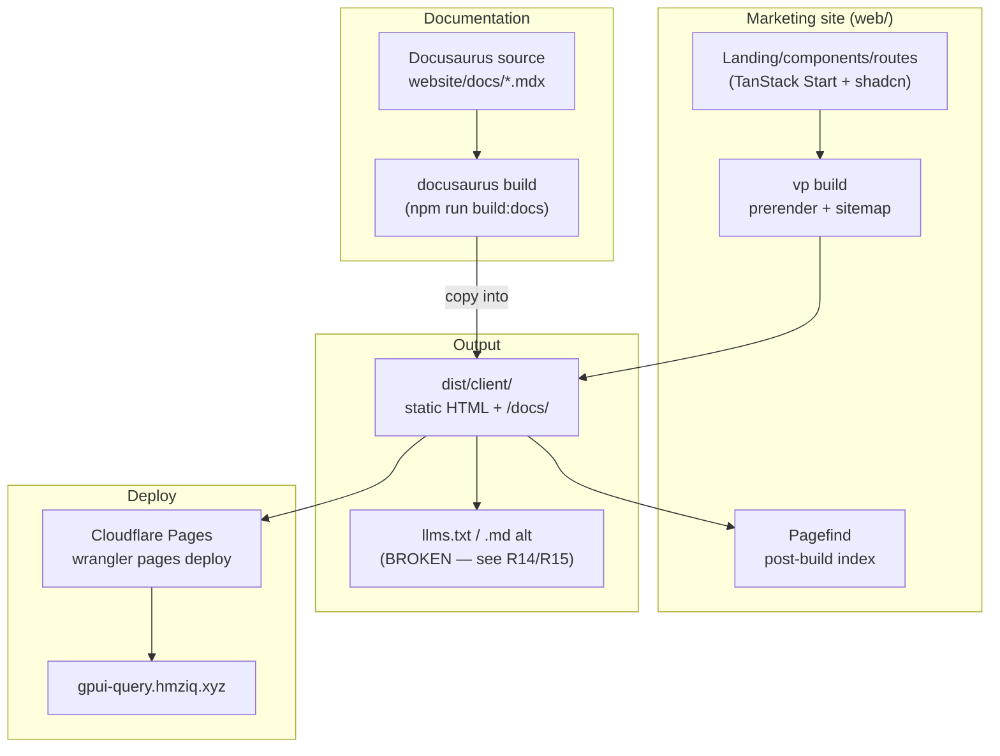

# feat: gpui-query documentation and marketing website

## Summary

gpui-query's web presence is a **two-part site** that ships together to Cloudflare Pages at `gpui-query.hmziq.xyz`:

1. **Marketing site (`web/`)** — a TanStack Start app, statically prerendered (SSG), that hosts the landing page, FAQ, about, changelog, and 404. Built with shadcn/ui, dark/light mode, Pagefind search, rehype-pretty-code Rust highlighting, and full per-route SEO.
2. **Documentation (`website/`)** — a **Docusaurus** project that authors the concept/API docs and compiles to static HTML, which the marketing build copies into `web/public/docs/` (via the `build:docs` script) so the whole site is served from one origin.

The marketing site and the Docusaurus docs are **built and deploying**. The **blog is not yet built**, and several AI-crawler/SEO scripts need reworking now that docs live in Docusaurus.

> **Architecture change since the original plan (2026-06-04).** The docs were going to be authored as MDX *inside* `web/` and rendered through a TanStack-Start content pipeline (`content.ts`, `import.meta.glob`, dynamic `$slug` routes, a custom `docs-sidebar`). That approach was abandoned in favor of **Docusaurus** (commit `c3abdee`) — see [KTD-2](#ktd-2--documentation-via-docusaurus-not-a-tanstack-start-mdx-pipeline). The obsolete `web/`-native content-system design has been removed from this plan.

---

## Current Status

| Area | Status | Notes |
|------|--------|-------|
| Marketing site (`web/`) — landing, chrome, FAQ, about, changelog, 404 | ✅ Done | Builds via `vp build`; prerendered SSG verified |
| Documentation (`website/` Docusaurus) | ✅ Done | 13 doc pages compiled into `web/public/docs/` |
| Design system (shadcn/ui, theme, code blocks, search dialog) | ✅ Done | `navigation-menu` shadcn component not added (navbar uses plain links) |
| SEO — meta tags, JSON-LD, sitemap, robots | 🟡 Partial | Home fully tagged; other routes missing `og:url`/`og:image`; some JSON-LD helpers unused |
| AI-crawler files — `llms.txt`, `llms-full.txt`, `.md` alternatives | ❌ Broken | Generator scripts read `web/src/content/`, which no longer exists post-Docusaurus migration |
| Blog | ❌ Not started | No routes, posts, or RSS; `rss.ts`/`generate-rss.mjs` are dead code |
| Deployment — Cloudflare Pages + GitHub Actions | 🟡 Partial | Push-to-main `deploy.yml` works; `pr-checks.yml` missing; `pnpm build` fails (config bug) |

### Remaining work (actionable)

- [ ] **Blog (U6)** — decide web/-native vs. Docusaurus, then build listing + posts + RSS. Remove or rewire the dead `generate-rss.mjs` / `src/lib/rss.ts`.
- [ ] **Fix the AI-crawler scripts (R14/R15)** — `generate-llms-txt.mjs` and `generate-md-alt.mjs` must read the Docusaurus source (`website/docs/`) instead of the removed `web/src/content/`.
- [ ] **Add PR CI (U9)** — `.github/workflows/pr-checks.yml` (checkout → pnpm → `vp install` → `vp check` → `vp test` → build dry-run).
- [ ] **Fix `pnpm run build`** — add `sharp` and `workerd` to `onlyBuiltDependencies` in `web/package.json` (currently `ERR_PNPM_IGNORED_BUILDS` at the `prepare` hook; `npx vp build` works).
- [ ] **Complete per-route SEO (U8)** — `og:url` + `og:image` on about/faq/changelog/404; replace the SVG OG image with a PNG `og-image.png`; emit (or remove) the unused `TechArticle`/`HowTo`/`BlogPosting` JSON-LD.
- [ ] **Expand docs to 18+ pages** — coverage of all three crate layers (core/client/hook) and every public hook/type.
- [ ] **Confirm deploy target** — currently `wrangler pages deploy` (Cloudflare **Pages**); decide vs. the original Workers/`assetsOnly` intent.

---

## Architecture

**Build flow:** `build:docs` compiles the Docusaurus project and copies its HTML into `web/public/docs/`. Then `vp build` prerenders the marketing routes, Pagefind indexes the output, and the AI-crawler scripts (currently broken) would emit `llms.txt`/`.md` files. The combined `dist/client/` is deployed to Cloudflare Pages on push to `main`.

---

## Requirements

**Site foundation and deployment**
- R1. Marketing site built with TanStack Start static prerendering (SSG), zero server runtime — ✅ done
- R2. Deployed to Cloudflare at `gpui-query.hmziq.xyz` via GitHub Actions — ✅ done (via Cloudflare **Pages**; see KTD-3)
- R3. shadcn/ui component library (base-sera/neutral preset) — ✅ done
- R4. Vite+ (`vp`) CLI for all `web/` dev/build commands — ✅ done

**Content and documentation**
- R5. Comprehensive docs covering all three layers (core / client / hooks) — 🟡 partial (13 Docusaurus pages; expand to 18+)
- R6. Docs authored in MDX with Rust syntax highlighting — ✅ done (Docusaurus MDX + rehype-pretty-code on the marketing side)
- R7. Marketing landing page (value prop, features, quick-start) — ✅ done
- R8. Blog system (posts, tags, RSS, listing) — ❌ not started
- R9. FAQ page with accordion + FAQPage structured data — ✅ done

**SEO and AI optimization**
- R10. Unique meta tags per route (title, description, canonical, OG, Twitter) — 🟡 partial (home complete; others missing `og:url`/`og:image`)
- R11. JSON-LD per page type (SoftwareSourceCode, TechArticle, HowTo, FAQPage, BlogPosting) — 🟡 partial (home + FAQ emit; TechArticle/HowTo/BlogPosting helpers unused — docs/blog live in Docusaurus)
- R12. Auto-generated `sitemap.xml` — ✅ done (marketing routes; Docusaurus emits its own)
- R13. `robots.txt` referencing the sitemap — ✅ done
- R14. `llms.txt` + `llms-full.txt` per llmstxt.org — ❌ broken (generator reads removed `web/src/content/`)
- R15. Raw `.md` alternatives for every doc page — ❌ broken (same root cause)

**Design and UX**
- R16. Documentation layout with persistent sidebar nav — ✅ done (Docusaurus provides it)
- R17. Code blocks with Rust highlighting + copy-to-clipboard — ✅ done
- R18. Fully responsive with mobile navigation — ✅ done
- R19. Dark/light mode via system preference + toggle — ✅ done
- R20. About page (project background, author, links) — ✅ done
- R21. Changelog page — 🟡 done (no JSON-LD)

---

## Key Technical Decisions

**KTD-1. Static prerendering via TanStack Start `prerender` config (marketing site).**
`prerender: { enabled: true }` in the `tanstackStart()` plugin renders the marketing routes to static HTML at build time. `autoStaticPathsDiscovery` enumerates the (static) marketing routes; `crawlLinks` is currently `false` — harmless because there are no dynamic routes in `web/`, but flip to `true` if dynamic routes are added.

**KTD-2. Documentation via Docusaurus, not a TanStack-Start MDX pipeline.**
Docs are authored in a separate **Docusaurus** project at `website/` and compiled into static HTML that the marketing build copies into `web/public/docs/` (`build:docs` script). This replaces the original plan's `web/`-native MDX content system (`content.ts`, `import.meta.glob`, dynamic `$slug` routes, custom sidebar/pagination/MDX-components, and `data-pagefind-body` Pagefind scoping — none of which exist in `web/`).
- **Why:** Docusaurus gives mature docs tooling (sidebar, versioning, search, MDX) for far less effort than a hand-rolled TanStack-Start content pipeline.
- **Trade-off:** two build systems (TanStack Start + Docusaurus) and a copy step; the marketing app's Pagefind search does not index docs (Docusaurus has its own search). The AI-crawler scripts (KTD-7) must read `website/docs/`, not `web/src/content/`.

**KTD-3. Cloudflare Pages deployment (not Workers/assetsOnly).**
The site deploys via `wrangler pages deploy dist/client` (Cloudflare **Pages**), triggered on push to `main` by `.github/workflows/deploy.yml`. The original plan's Workers + `assetsOnly: true` approach was changed to Pages. (`wrangler.jsonc` still lists a `main` Worker entry — harmless under Pages but inconsistent with a pure-static intent; clean up if standardizing on Pages.)

**KTD-4. Pagefind for marketing-site search.**
Pagefind indexes the prerendered marketing HTML post-build and powers the `Cmd/Ctrl+K` search dialog (lazy-loaded). Docs search is provided by Docusaurus, not Pagefind.

**KTD-5. rehype-pretty-code + shiki for marketing code blocks; Docusaurus MDX for docs.**
Marketing code blocks use rehype-pretty-code/shiki at build time (no client-side highlighting). Docusaurus handles its own MDX/highlighting for docs.

**KTD-6. Vite+ (`vp`) CLI for the marketing app.**
All `web/` commands use `vp` (`dev`, `build`, `check`, `test`). The staged lint runs `vp check --fix`. Docusaurus uses its own `docusaurus` CLI via `build:docs`.

**KTD-7. `llms.txt` / `llms-full.txt` / `.md` alternatives generated from Docusaurus content.**
Plain-text/markdown files for AI crawlers are produced by build-time scripts (`scripts/generate-llms-txt.mjs`, `scripts/generate-md-alt.mjs`), not served through TanStack Router's HTML layout. **These are currently broken** — they read `web/src/content/`, which was removed when docs moved to Docusaurus; they must be reworked to read `website/docs/`.

---

## Implementation Units

> Status markers: ✅ done · 🟡 partial · ❌ not started

### U1. Project Foundation and SSG Configuration — ✅ done
TanStack Start scaffold configured for SSG: `vite.config.ts` (prerender + sitemap host + MDX plugin chain before `tanstackStart()` + `assetsOnly` on the Cloudflare plugin), `wrangler.jsonc` (`name: gpui-query`), MDX/shiki/pagefind deps, shadcn init, `tsconfig` MDX types, `styles.css` (shadcn vars + prose), root route (title, Navbar/Footer, DEV-gated devtools, FOUC theme script, skip-link).
*Verified: `vp build` prerenders the landing page to static HTML with correct title, sitemap, and JSON-LD.*

### U2. Design System and Shared Components — 🟡 partial
Shared components built: navbar (sticky, scroll-shadow, `Cmd+K`, GitHub link), footer, mobile-nav (Sheet, closes on nav), theme-toggle (localStorage + system, FOUC-safe), code-block (copy with 2s feedback), callout (info/warning/tip/note), search-dialog (Pagefind, lazy-loaded, arrow-nav), `seo.ts` (5 JSON-LD factories), and 17 shadcn `ui/` components.
*Gap: `navigation-menu` shadcn component not added (navbar uses plain links). Docs-specific components (sidebar/pagination/mdx-components) are no longer needed in `web/` — they live in Docusaurus.*

### U3. Documentation via Docusaurus — ✅ done
Separate Docusaurus project at `website/` authors the docs in MDX; `build:docs` compiles them and copies the output into `web/public/docs/`. Docusaurus provides the sidebar, versioning, and search.
*This unit replaces the original "Content Infrastructure" (`content.ts`, `import.meta.glob`, `web/src/content/`).*

### U4. Marketing Landing Page — ✅ done
`src/routes/index.tsx` composes hero (tagline + CTAs + live query terminal), feature showcase (6 cards), quick-start (cargo add + `use_query`), comparison table (vs `cx.spawn` / raw futures), architecture (three-layer Hook/Client/Core), and CTA. Responsive, accessible (semantic headings, table headers, `aria-hidden` decor, skip-link). Emits `SoftwareSourceCode` JSON-LD.

### U5. Documentation Content — 🟡 partial
13 Docusaurus doc pages cover installation, queries, mutations, caching, etc.
*Remaining: expand to 18+ pages spanning all three crate layers and every public hook/type (infinite queries, query-keys, observers, devtools, persistence, error-handling, select-pattern, comparison, v1→v2 migration, full API reference).*

### U6. Blog System — ❌ not started
No blog routes, posts, RSS feed, or tag filtering. `src/lib/rss.ts` and `scripts/generate-rss.mjs` exist but are dead code (dangling `content` import).
*Decision needed: build the blog in `web/` (per the original plan) or as part of Docusaurus. Then implement listing + post pages + tag filter + RSS, and remove/rewire the dead RSS code.*

### U7. FAQ, About, Changelog, 404 — 🟡 mostly done
- FAQ: accordion (`type="multiple"`) + `FAQPage` JSON-LD, ~10 Q&As — ✅ done
- About: project/author/license + links — ✅ done
- 404: styled not-found — ✅ done (meta is title+description only; add canonical/OG)
- Changelog: version history — 🟡 done but no JSON-LD; links point to `/docs/{slug}` (now in Docusaurus)

### U8. SEO and AI Optimization Layer — 🟡 partial
- Meta: home route fully tagged (title/description/canonical/OG/Twitter); about/faq/changelog/404 omit `og:url`/`og:image`.
- JSON-LD: `SoftwareSourceCode` (home) + `FAQPage` (faq) emitted and valid; `TechArticle`/`HowTo`/`BlogPosting` helpers exist but are unused (no web/-side docs/blog routes).
- Sitemap + robots: generated and correct for marketing routes.
- **AI-crawler scripts broken** (KTD-7): `generate-llms-txt.mjs` / `generate-md-alt.mjs` read removed `web/src/content/` → empty/stale output.
- OG image is an SVG (`og-image.svg`); plan wanted a PNG (`og-image.png`) for universal crawler support.

### U9. Deployment and CI/CD — 🟡 partial
- `deploy.yml` (push to `main`): checkout → pnpm → `vp install` → build → `wrangler pages deploy` — ✅ works
- `pr-checks.yml`: ❌ missing
- Build scripts: `build` chains `build:docs` + `vp build` + pagefind + rss/llms/md-alt; diverges from the original "vp build + pagefind + llms + md-alt against `.output/public`" (now `dist/client`)
- **`pnpm run build` fails**: `ERR_PNPM_IGNORED_BUILDS` (add `sharp` + `workerd` to `onlyBuiltDependencies`); `npx vp build` succeeds
- Custom domain `gpui-query.hmziq.xyz` referenced throughout; live status not verified from here

---

## Scope Boundaries

**In scope**
- Marketing site (landing, FAQ, about, changelog, 404) via TanStack Start SSG — done
- Documentation via Docusaurus — done, expanding
- Cloudflare Pages deployment with custom domain — done
- shadcn/ui, dark/light mode, Pagefind search, Rust highlighting — done
- Per-route SEO + structured data + sitemap — partial
- AI-crawler files (llms.txt, .md alternatives) — broken, to rework
- Blog — not started
- GitHub Actions CI/CD — deploy works, PR checks missing

**Deferred to follow-up**
- Interactive Rust code playground / REPL
- Versioned documentation (multiple crate versions)
- i18n / multi-language
- Automated API reference from rustdoc JSON
- Privacy-focused analytics (Plausible/Umami)
- Newsletter / community features

---

## Risks

| Risk | Severity | Mitigation |
|------|----------|------------|
| Two build systems (TanStack Start + Docusaurus) + copy step add complexity | Medium | Keep `build:docs` deterministic; document the two-system split for contributors |
| AI-crawler scripts broken after the Docusaurus migration | High (active) | Rework `generate-llms-txt.mjs` / `generate-md-alt.mjs` to read `website/docs/` |
| `pnpm run build` fails on `prepare` | Medium (active) | Add `sharp` + `workerd` to `onlyBuiltDependencies` |
| Blog not built; RSS code is dead | Medium | Decide web/-native vs. Docusaurus in U6; remove dead code |
| SEO meta incomplete on non-home routes | Low | Apply shared meta helper to all routes; produce PNG OG image |
| Deploy target drift (Pages vs. Workers/assetsOnly) | Low | Confirm intended platform; clean up `wrangler.jsonc` `main` entry |
